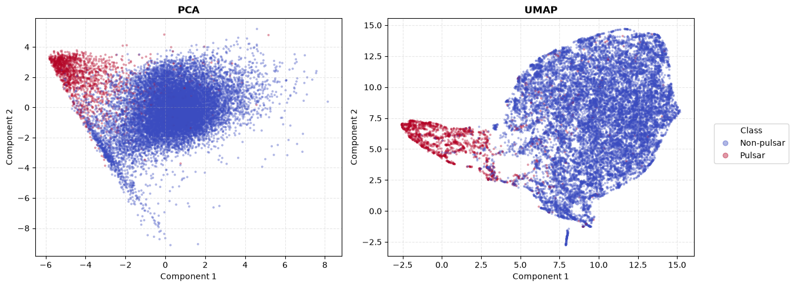
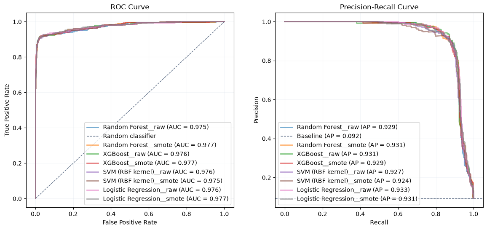
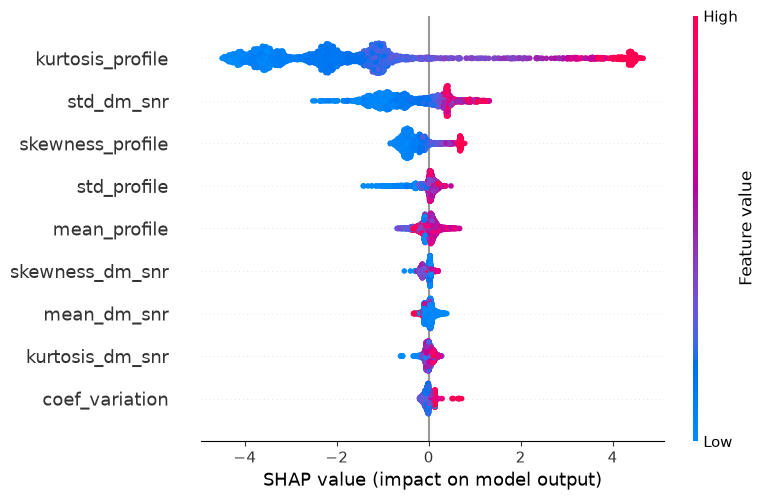

# Pulsar Star Detection — End-to-End ML Pipeline

Binary classification of pulsar candidates from the [HTRU2](https://archive.ics.uci.edu/dataset/372/htru2) dataset, covering the full pipeline: EDA → model experimentation → evaluation → REST API.

Manually verifying pulsar candidates from radio telescope surveys is expensive. This project builds and deploys a classifier that filters out noise (~91% of candidates), so astronomers can focus on the most promising signals.

## Results at a glance

| Model | PR-AUC (AP) | Recall | Precision | F1 |
|---|---|---|---|---|
| **Logistic Regression (baseline) — selected** | **0.9337** | **0.9207** | 0.7844 | 0.8471 |
| Logistic Regression (Optuna, raw) | 0.9331 | 0.8445 | 0.9358 | 0.8887 |
| SVM (RBF kernel, raw) | 0.9272 | 0.8323 | 0.9349 | 0.8806 |
| XGBoost (Optuna, raw) | 0.9314 | 0.9146 | 0.8021 | 0.8547 |
| Dummy (sanity check) | 0.0916 | 0.0000 | — | — |

Eight models/variants were evaluated in total (Logistic Regression, Random Forest, XGBoost, SVM — each raw and SMOTE-resampled). A plain, untransformed Logistic Regression matched or outperformed every hyperparameter-tuned, feature-engineered, and ensembled alternative — see [Key findings](#key-findings) for why.

## Key findings

- **The class boundary is close to linear.** PCA and UMAP projections both show pulsars forming a largely separate region using only 2 components — extensive Optuna tuning, Yeo-Johnson transforms, and tree ensembles gave no meaningful improvement over a plain Logistic Regression.
- **Two features drive almost all separation.** `kurtosis_profile` and `skewness_profile` (integrated pulse profile) show near-zero IQR overlap between classes and dominate SHAP importance — confirmed independently by EDA correlation analysis (r=0.79 with target) and XGBoost's own feature attribution.
- **SMOTE gave no reliable gain** across any model family tested (RF, XGBoost, SVM, Logistic Regression) — differences were within cross-validation noise.
- **PR-AUC ≠ a good default operating point.** Optuna-tuned Logistic Regression and SVM reached similar PR-AUC to the baseline but landed at a more precision-leaning point at threshold=0.5 (Recall 0.84 vs 0.92) — a reminder that the metric you optimize for isn't always the metric that matches your deployment priority. Since missing a real pulsar is costlier than a false alarm, Recall was prioritized, and the baseline's default threshold already aligns with that — no threshold tuning was needed for the final model, though it remains a documented, adjustable lever (e.g. threshold=0.232 trades Precision for higher Recall if priorities shift).

<p align="center">
  
</p>

<p align="center">
  
</p>

<p align="center">
  
</p>

## Dataset

**HTRU2** (High Time Resolution Universe Survey) — 17,898 candidates, 8 continuous features describing two signal statistics, highly imbalanced target (~9.16% pulsars).

| Feature | Description |
|---|---|
| `mean_profile`, `std_profile`, `kurtosis_profile`, `skewness_profile` | Statistics of the integrated pulse profile |
| `mean_dm_snr`, `std_dm_snr`, `kurtosis_dm_snr`, `skewness_dm_snr` | Statistics of the DM-SNR curve |
| `target` | 1 = pulsar, 0 = non-pulsar (noise/RFI) |

## Project structure

```
pulsar-detector/
├── data/raw/                    # HTRU_2.csv (not committed — see Setup)
├── notebooks/
│   ├── 01_eda.ipynb               # EDA, data dictionary, univariate/bivariate analysis
│   ├── 02_baseline.ipynb          # Dummy + Logistic Regression baseline
│   └── 03_modeling.ipynb          # PCA/UMAP, Optuna + MLflow search, SHAP, final selection
├── src/
│   ├── data.py                     # loading, stratified split, saving artifacts
│   ├── features.py                 # feature engineering (dispersion ratio)
│   ├── modeling.py                  # pipeline builders
│   ├── evaluate.py                  # metrics, learning curves, ROC/PR/confusion matrix plots
│   ├── optuna_search.py             # Optuna + MLflow parent/child run orchestration
│   ├── orchestrator.py               # runs the full model × SMOTE benchmark grid
│   └── train.py                       # final model training (full dataset) + serialization
├── api/
│   ├── main.py                     # FastAPI app (/predict, /health)
│   ├── schemas.py                   # Pydantic request/response models
│   └── predictor.py                  # model loading + inference
├── models/pulsar_model.joblib      # serialized final pipeline (generated by train.py)
├── docs/
│   ├── figures/                     # EDA & modeling plots (referenced in notebooks/README)
│   └── tables/                      # exported metrics (baseline, summary_metrics, summary_records)
├── tests/test_api.py
├── Dockerfile
├── requirements.txt                 # minimal deps for the API/Docker image
└── environment.yml                  # full conda dev environment (EDA/modeling)
```

## Setup

### Development environment (EDA, notebooks, experimentation)

```bash
conda env create -f environment.yml
conda activate pulsar-detector
```

Download `HTRU_2.csv` from the [UCI repository](https://archive.ics.uci.edu/dataset/372/htru2) and place it in `data/raw/`.

Run the notebooks in order: `01_eda.ipynb` → `02_baseline.ipynb` → `03_modeling.ipynb`. MLflow experiment tracking can be inspected locally with:

```bash
mlflow ui
```

### Train the final model

```bash
python -m src.train
```

Trains the selected Logistic Regression pipeline on the full dataset and saves it to `models/pulsar_model.joblib`.

## Running the API

### Locally

```bash
pip install -r requirements.txt
uvicorn api.main:app --reload
```

Open `http://127.0.0.1:8000/docs` for interactive Swagger UI.

```bash
curl -X POST "http://127.0.0.1:8000/predict" \
  -H "Content-Type: application/json" \
  -d '{"mean_profile": 140.5, "std_profile": 55.7, "kurtosis_profile": -0.2, "skewness_profile": 0.3, "mean_dm_snr": 3.2, "std_dm_snr": 19.1, "kurtosis_dm_snr": 7.9, "skewness_dm_snr": 74.2}'
```

The `/predict` endpoint accepts an optional `threshold` query parameter (default `0.5`) to shift the precision/recall trade-off.

### Docker

```bash
docker build -t pulsar-api .
docker run -p 8000:8000 pulsar-api
```

### Tests

```bash
pytest tests/
```

## Methodology summary

1. **EDA** — data dictionary, univariate/bivariate analysis, correlation and multicollinearity checks, outlier assessment (kept — outliers represent genuine pulsar signal, not noise).
2. **Baseline** — Dummy classifier (sanity check) + standardized Logistic Regression, establishing PR-AUC as the primary metric given the ~1:10 class imbalance.
3. **Modeling** — PCA/UMAP visual + quantitative check of linear separability; Random Forest, XGBoost, SVM (RBF), and an enhanced Logistic Regression, each tuned via Optuna with 5-fold stratified CV and tracked in MLflow (parent/child runs); SMOTE vs. class-weighting comparison; SHAP-based feature attribution; final model selection based on test PR-AUC and Recall.
4. **Deployment** — final pipeline serialized with `joblib`, served via FastAPI, containerized with Docker, covered by basic API tests.

## License

MIT
